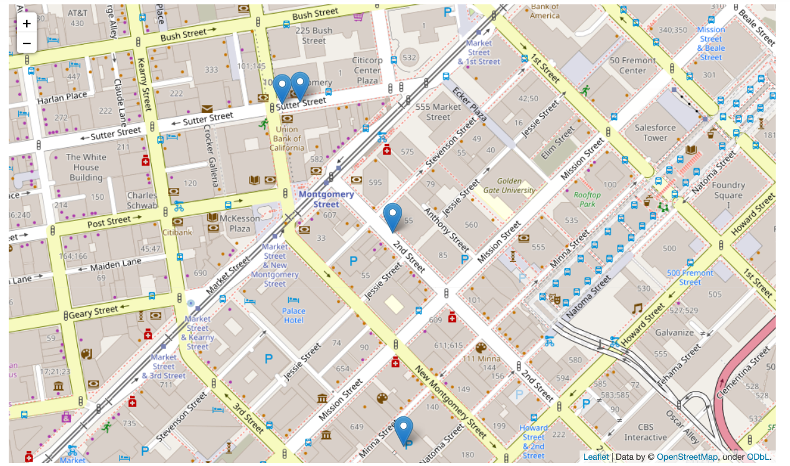
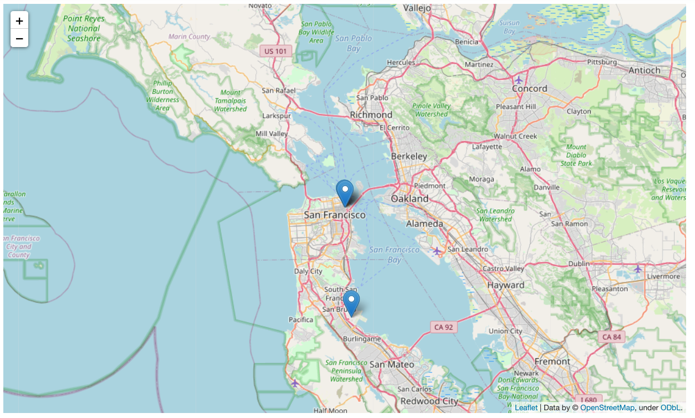
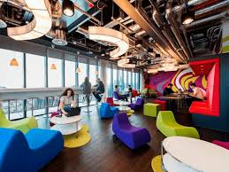

# Geospatial-Data-Project

Somos una empresa desarrolladora de videojuegos y tenemos que decidir donde establecemos nuestros Headquarters. 

Contamos con la siguiente plantilla:

    - Diseñadores fronted / backend
    - UI/UX Engineers
    - Account Managers

Disponemos de una base de datos real de 18k empresas , donde hacemos un filtrado,mediante compass mongodb, en base a 2 criterios importantes:

1) Nuestros desarrrolladores adoran estar rodeados de otras compañías desarrolladoras para compartir información y conocimiento.

2) Estar rodeados de Startups potentes que hayan levantado más de 1 millon de dolares en la ronda de financiación.

En función de nuestra búsqueda, observamos que San Francisco es la ciudad con mayor representación (27) seguida de Nueva York(21) por lo que decidimos establecernos en la ciudad de San Francisco.

Vemos que adicionalmente hay 193 empresas que cumplen con nuestros dos principales requisitos, por lo que decidimos establecernos ahi.

Decidimos establecer probisionalmente nuestra oficina en las oficinas de Hi 5, (55 Second Street , Suite 400, 94105, San Francisco, USA) en el edificio de KPMG y nos establecemos aquí provisionalmente para ver si podemos satisfacer los deseos de nuestros desarrolladores:

## Peticiones:

 - Estar cerca de startups desarrolladoras. localizamos (150 empresas a una distancia de 500m)

 - Buscamos que haya un Starbucks cerca de nuestra oficina y localizamos uno a 205 m de distancia. 

 - La media de edad de la compañía está entre los 25 y los 40 años por lo que el 30% tiene hijos. Este criterio es importante para nosotros y encontramos el colegio EC San Francisco a tan solo 194 m de distancia.

 - Contamos con 20 account managers que necesitarán viajar con mucha frequencia para expandir nuestro negocio, por lo que localizanos que el aeropuesto de San Francisco , está sólamente a 19,178 km de distancia de la oficina, lo que no suponen más de 15 minutos en coche para llegar.

 - No todo va a ser trabajar! por lo que pensamos que es importante que la gente de la empresa se pueda divertir y localizamos que hay un bar de copas para los jueves - viernes a tan sólo 3,554 km de nuestra oficina.

 - Pensamos que la cultura es importante , por lo que tener cerca el museo SF MOMA a tan sólo 259 m puede servir de gran inspiración para nuestros desarrolladores.

 ## Representamos gráficamente la geolocalización (peticiones vs localización de la oficina)

## Distancia de la oficina con respecto al aeropuerto:

## Conclusión

Tras analizar todos estos criterios decidimos establecer fin almente nuestra oficina en las oficinas de HI5 (55 Second Street , Suite 400, 94105, San Francisco, USA) con longitud: 37.788668 y latitud: -122.400558

